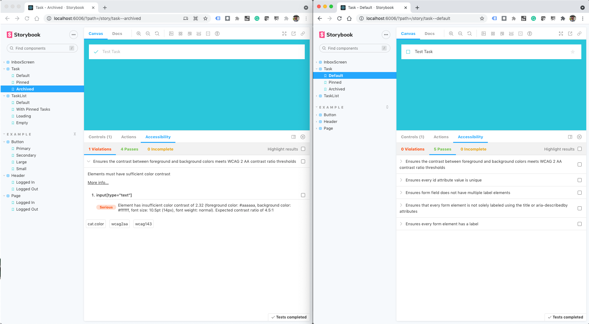
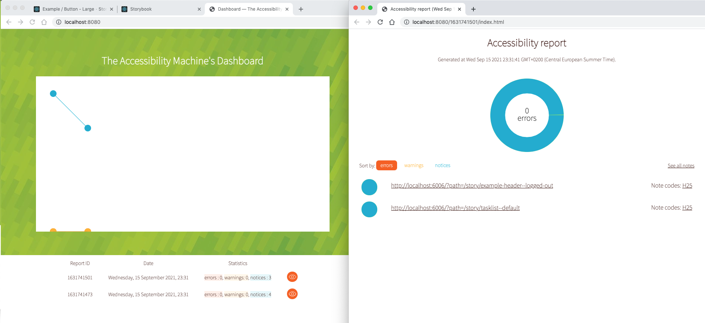

<h1 align="center">
  Storybook React Example
</h1>

This template ships with the main React and Storybook configuration files you'll need to get up and running fast.

## 🚅  Quick start

1.  **Install the dependencies.**

    Navigate into your new site’s directory and install the necessary dependencies.

    ```shell
    # Navigate to the directory
    cd taskbox/

    # Install the dependencies
    yarn
    
    # Start the app
    yarn start
    ```

1.  **Open the source code and start editing!**

    Open the `taskbox` directory in your code editor of choice and building your first component!

1.  **Browse your stories!**

    Run `yarn storybook` to see your component's stories at `http://localhost:6006`

## 🔎 What's inside?

A quick look at the top-level files and directories included with this template.

    .
    ├── .storybook
    ├── node_modules
    ├── public
    ├── src
    ├── .gitignore
    ├── LICENSE
    ├── package.json
    ├── yarn.lock
    └── README.md


1.  **`.storybook`**: This directory contains Storybook's [configuration](https://storybook.js.org/docs/react/configure/overview) files.

2.  **`node_modules`**: This directory contains all of the modules of code that your project depends on (npm packages).

3.  **`public`**: This directory will contain the development and production build of the site.

4.  **`src`**: This directory will contain all of the code related to what you will see on your application.

5.  **`.gitignore`**: This file tells git which files it should not track or maintain during the development process of your project.

6. **`LICENSE`**: The template is licensed under the MIT licence.

7. **`package.json`**: Standard manifest file for Node.js projects, which typically includes project specific metadata (such as the project's name, the author among other information). It's based on this file that npm will know which packages are necessary to the project.

8. **`yarn.lock`**: This is an automatically generated file based on the exact versions of your npm dependencies that were installed for your project. **(Do not change it manually).**

9. **`README.md`**: A text file containing useful reference information about the project.

## Visual Regression Testing
```shell
# You will need to start Storybook before running this command.
yarn creevey --ui
yarn creevey

# Approve all images from report directory
yarn creevey --update
```

```shell
yarn loki test
# Review changes in difference folder
# Approve changes and update references
yarn loki approve
```

### Sources
- https://github.com/wKich/creevey
- https://github.com/wKich/creevey/blob/master/docs/config.md
- https://github.com/wKich/creevey/blob/master/docs/tests.md
- https://github.com/oblador/loki
- https://loki.js.org/getting-started.html
- https://loki.js.org/flaky-tests.html

## Accessibility testing
```shell
# You will need to start Storybook before running this command.
yarn test:a11y
```

```shell
yarn storybook:axe
```
```shell
# Source https://github.com/liip/TheA11yMachine
./node_modules/.bin/a11ym-dashboard --root a11ym_output/
# You will need to start Storybook before running this command.
./node_modules/.bin/a11ym --standards WCAG2AA --output-directory a11ym_output/`date +%s`/ http://localhost:6006/?path=/story/inboxscreen--default http://localhost:6006/?path=/story/tasklist--default http://localhost:6006/?path=/story/example-header--logged-out http://localhost:6006/?path=/story/example-page--logged-out
```


### Sources
- https://www.npmjs.com/package/@storybook/addon-a11y
- https://medium.com/storybookjs/instant-accessibility-qa-linting-in-storybook-4a474b0f5347
- https://github.com/chanzuckerberg/axe-storybook-testing
- https://storybook.js.org/addons/storybook-a11y-report
- https://github.com/dequelabs/axe-core/blob/develop/doc/API.md#getting-started

## Performance testing
```shell
npm install -g @lhci/cli
yarn
yarn build

# It uses this config 'lighthouserc.js' file
lhci autorun
```

### Source
- https://github.com/GoogleChrome/lighthouse-ci/blob/main/docs/getting-started.md
- https://github.com/GoogleChrome/lighthouse-ci/blob/main/docs/configuration.md


## Contribute

If you encounter an issue with the template, we encourage you to open an issue in this template's repository.

## Learning Storybook

1. Read our introductory tutorial at [Learn Storybook](https://www.learnstorybook.com/intro-to-storybook/react/en/get-started/).
2. Learn how to transform your component libraries into design systems in our [Design Systems for Developers](https://www.learnstorybook.com/design-systems-for-developers/) tutorial.
2. See our official documentation at [Storybook](https://storybook.js.org/).
